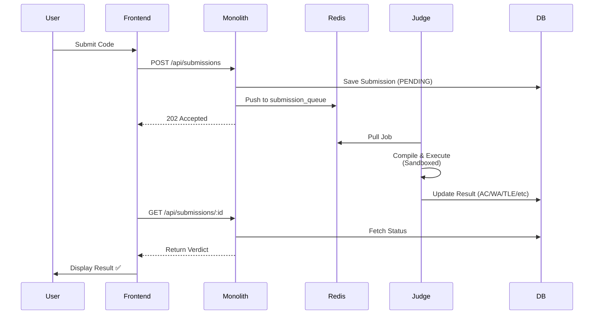

# 🏆 CodeJudge - Competitive Programming Platform

<div align="center">


A high-performance online judge system with **real-time contests**, **plagiarism detection**, and **secure sandboxed execution**.

[Features](#-features) • [Quick Start](#-quick-start) • [Architecture](#-architecture) • [Documentation](#-documentation) • [API](#-api-reference)

</div>

---

## ✨ Features

### 🎯 Core Functionality
- **Problem Management** - Create and solve algorithmic problems
- **Multi-Language Support** - C++, Python, Java
- **Secure Execution** - Sandboxed code execution with resource limits
- **Real-time Judging** - Fast verdict delivery with detailed feedback
- **Test Cases** - Public sample cases + hidden test cases

### 🏆 Contest System (Like Codeforces!)
- **Time-based Contests** - Upcoming, Active, Finished states
- **Live Leaderboard** - Real-time rankings with auto-refresh
- **Leaderboard Freeze** - Freeze standings in final minutes
- **Custom Scoring** - Assign point values per problem
- **User Registration** - Easy contest sign-up
- **Penalty System** - Time-based penalty in rankings

### 🔍 Plagiarism Detection
- **Automated Detection** - MinHash LSH algorithm
- **Code Similarity** - Compare submissions automatically
- **Admin Reports** - Review flagged submissions

### 🎨 User Interface
- **Modern Design** - Clean, responsive interface
- **Dark Mode** - Easy on the eyes
- **LaTeX Support** - Render mathematical equations (KaTeX)
- **Real-time Updates** - Live submission status
- **Mobile Friendly** - Works on all devices

### 🔐 Security & Admin
- **JWT Authentication** - Secure user sessions
- **Role-based Access** - User vs Admin permissions
- **Admin Dashboard** - Manage platform
- **Rate Limiting** - Prevent abuse

---

## 🚀 Quick Start

### Prerequisites
- Docker & Docker Compose
- 4GB RAM minimum
- 10GB free disk space

### Installation

```bash
# Clone the repository
git clone https://github.com/kwant-dbg/CodeJudge.git
cd CodeJudge

# Start all services
docker-compose up -d --build

# Access the platform
open http://localhost:8080
```

That's it! 🎉 CodeJudge is now running.

### First Steps

1. **Register** - Create your account
2. **Browse Problems** - Explore available challenges
3. **Submit Solution** - Write and submit code
4. **Check Contests** - Join competitive contests
5. **(Admin) Create Contest** - Set up your own programming competition

---

## 📐 Architecture

CodeJudge uses a **monolithic architecture** for simplicity and performance:

```mermaid
graph TB
    subgraph "Client Layer"
        Browser[🌐 Web Browser]
    end

    subgraph "Monolith Service - Go"
        Router[Chi Router]
        Auth[JWT Auth]
        Handlers[API Handlers<br/>Problems | Submissions<br/>Contests | Plagiarism]
    end

    subgraph "Judge Service - C++"
        Judge[Judge Worker]
        Sandbox[Secure Sandbox]
    end

    subgraph "Data Layer"
        PostgreSQL[(PostgreSQL<br/>Data Storage)]
        Redis[(Redis<br/>Job Queue)]
    end

    Browser --> Router
    Router --> Auth
    Auth --> Handlers
    Handlers --> PostgreSQL
    Handlers --> Redis
    Redis --> Judge
    Judge --> Sandbox
    Judge --> PostgreSQL

    style Browser fill:#667eea,color:#fff
    style Router fill:#10b981,color:#fff
    style PostgreSQL fill:#ef4444,color:#fff
    style Redis fill:#f59e0b,color:#fff
    style Judge fill:#8b5cf6,color:#fff
```

**📚 Detailed Architecture:** See [ARCHITECTURE.md](docs/ARCHITECTURE.md) for comprehensive diagrams including:
- System architecture overview
- Request flow diagrams
- Database schema (ERD)
- Authentication flow
- Contest system logic
- Security layers
- Deployment architecture


---

## 📁 Project Structure

```
codejudge/
├── 🏢 monolith/              # Go Backend Service
│   ├── handlers/
│   │   ├── auth.go           # Authentication & user management
│   │   ├── problems.go       # Problem CRUD operations
│   │   ├── submissions.go    # Code submission & judging
│   │   ├── contests.go       # Contest management & leaderboards
│   │   ├── plagiarism.go     # Similarity detection
│   │   └── admin.go          # Admin operations
│   ├── static/
│   │   ├── index.html        # Homepage & navigation
│   │   ├── problem.html      # Problem view & submit
│   │   ├── contests.html     # Contest listings
│   │   ├── contest-detail.html   # Contest leaderboard
│   │   ├── create-contest.html   # Admin: Create contest
│   │   └── ...
│   ├── main.go               # Server entrypoint
│   └── Dockerfile.standalone
│
├── ⚖️ judge/                  # C++ Judge Service
│   ├── modern_main.cpp       # Judge worker
│   ├── sandbox.cpp           # Secure execution sandbox
│   ├── sandbox.h
│   └── Dockerfile.modern
│
├── 📚 common/                 # Shared Go Libraries
│   ├── auth/                 # JWT utilities
│   ├── dbutil/               # Database connection pooling
│   ├── health/               # Health checks
│   ├── httpx/                # HTTP helpers
│   └── redisutil/            # Redis queue management
│
├── 📖 docs/
│   ├── ARCHITECTURE.md       # Detailed architecture diagrams
│   ├── CONTESTS_FEATURE.md   # Contest system documentation
│   ├── DEPLOYMENT.md         # Deployment guides
│   └── SAMPLE_*.md           # Sample data
│
├── 🚀 deploy/                 # Deployment Scripts
│   ├── azure-deploy.ps1
│   ├── seed-db.sh
│   └── seed-db.sql
│
└── docker-compose.yml        # Local Development Setup
```

---

## 🔧 How It Works



**Key Flow:**
1. User submits code through the web interface
2. Monolith saves submission to PostgreSQL and queues it in Redis
3. Judge service pulls job, compiles code in secure sandbox
4. Judge runs test cases with time/memory limits
5. Results are stored in database
6. Frontend polls for real-time status updates

---

## 💻 Development

### Local Setup

```bash
# Install dependencies
cd monolith
go mod download

# Run monolith locally (requires PostgreSQL & Redis)
go run main.go

# Build judge service
cd ../judge
g++ -std=c++17 modern_main.cpp sandbox.cpp -o judge
```

### Database Migrations

```bash
# Seed sample data
cd deploy
./seed-db.sh

# Or manually
psql -U postgres -d codejudge -f seed-db.sql
```

### Docker Development

```bash
# Rebuild specific service
docker-compose build monolith
docker-compose up -d monolith

# View logs
docker-compose logs -f monolith judge

# Reset everything
docker-compose down -v
docker-compose up -d --build
```

---

## 🧪 Testing

```bash
# Run all tests
cd monolith
go test ./...

# Test specific package
go test ./handlers -v

# With coverage
go test -coverprofile=coverage.out ./...
go tool cover -html=coverage.out
```

---

## 📚 Documentation

- **[Architecture Guide](docs/ARCHITECTURE.md)** - System design, database schema, flows
- **[Contest System](docs/CONTESTS_FEATURE.md)** - Contest API, leaderboard logic
- **[Deployment Guide](docs/DEPLOYMENT.md)** - Azure, Docker, production setup
- **[Sample Problems](docs/SAMPLE_PROBLEMS.md)** - Example problem set
- **[Sample Solutions](docs/SAMPLE_SOLUTIONS.md)** - Reference solutions

---

## 🌐 API Reference

### Authentication
- `POST /api/register` - Create new user
- `POST /api/login` - Get JWT token
- `POST /api/validate` - Validate JWT
- `GET /api/me` - Get current user info

### Problems
- `GET /api/problems` - List all problems
- `GET /api/problems/:id` - Get problem details
- `POST /api/problems` - Create problem (admin)
- `POST /api/problems/:id/testcases` - Add test cases (admin)

### Submissions
- `POST /api/submissions` - Submit solution
- `GET /api/submissions/:id` - Get submission status

### Contests
- `GET /api/contests` - List contests
- `POST /api/contests` - Create contest (admin)
- `GET /api/contests/:id` - Get contest details
- `POST /api/contests/:id/register` - Register for contest
- `GET /api/contests/:id/leaderboard` - Live leaderboard
- `POST /api/contests/:id/problems` - Add problem to contest (admin)

### Plagiarism
- `GET /api/plagiarism/reports` - Get plagiarism reports (admin)

**Example Submission:**
```json
{
  "problem_id": 1,
  "language": "cpp",
  "source_code": "#include <iostream>\nint main() { int a, b; std::cin >> a >> b; std::cout << a + b; return 0; }"
}
```

**Full API documentation:** See [ARCHITECTURE.md](docs/ARCHITECTURE.md#api-endpoints)

---

## 🎯 Roadmap

- [ ] Multi-language support (Rust, JavaScript, Go)
- [ ] Virtual contests (practice mode)
- [ ] Editorial system (problem explanations)
- [ ] User profiles with statistics
- [ ] Discussion forums
- [ ] Email notifications
- [ ] Export submissions to PDF
- [ ] Mobile app (React Native)

---

## 🤝 Contributing

Contributions are welcome! Please follow these steps:

1. Fork the repository
2. Create your feature branch (`git checkout -b feature/amazing-feature`)
3. Commit your changes (`git commit -m 'Add amazing feature'`)
4. Push to the branch (`git push origin feature/amazing-feature`)
5. Open a Pull Request

### Code Style
- Go: Follow [Effective Go](https://golang.org/doc/effective_go)
- C++: Use `clang-format` with Google style
- Frontend: Use 2-space indentation, semicolons

---

## 📄 License

This project is licensed under the **MIT License** - see the [LICENSE](LICENSE) file for details.

---

## 👨‍💻 Author

**Harshit Sharma**
- GitHub: [@kwant-dbg](https://github.com/kwant-dbg)

---

## 🙏 Acknowledgments

- Inspired by [Codeforces](https://codeforces.com) and [AtCoder](https://atcoder.jp)
- Plagiarism detection based on MinHash LSH algorithm
- Sandbox implementation using Linux namespaces and cgroups
- KaTeX for beautiful math rendering

---

<div align="center">

Made with ❤️ by competitive programmers, for competitive programmers

⭐ **Star this repo if you find it useful!**

</div>

