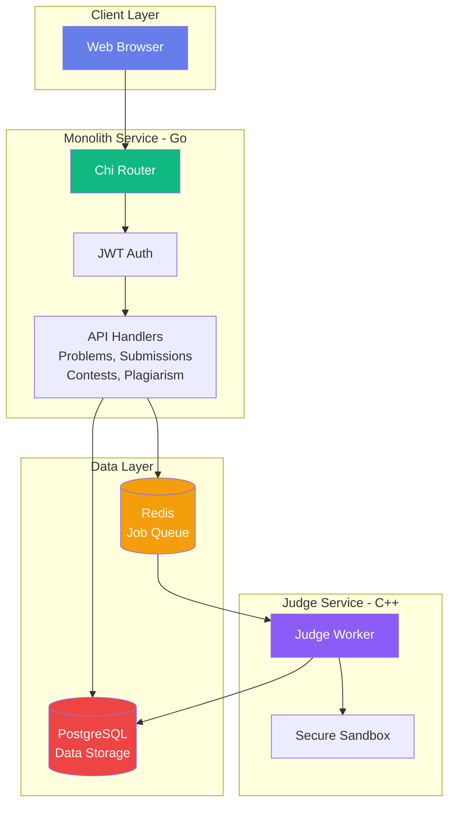

# CodeJudge

<p align="center">


A production-ready online judge system featuring real-time contest management, automated plagiarism detection, and secure sandboxed code execution.

[Features](#features) • [Quick Start](#quick-start) • [Architecture](#architecture) • [Documentation](#documentation) • [API](#api-reference)

</p>

---

## Features

- **Problem Management** - Create and manage coding problems with LaTeX support
- **Multi-Language Support** - C++, Python, and Java compilation
- **Secure Sandbox** - Isolated execution with resource limits
- **Contests** - Time-based contests with live leaderboards and freeze periods
- **Plagiarism Detection** - MinHash LSH algorithm for code similarity
- **Modern UI** - Responsive design with dark mode and real-time updates
- **JWT Authentication** - Secure token-based authentication with role-based access
- **Admin Dashboard** - Centralized platform management

---

## Quick Start

### Prerequisites
- Docker & Docker Compose
- 4GB RAM minimum

### Installation

```bash
git clone https://github.com/kwant-dbg/CodeJudge.git
cd CodeJudge
docker-compose up -d --build
```

Access the platform at `http://localhost:8080`

---

## Architecture

CodeJudge uses a **monolithic architecture** for simplicity and performance:



See [ARCHITECTURE.md](docs/ARCHITECTURE.md) for detailed system design, database schema, and API flows.


---

## Project Structure

```
codejudge/
├── monolith/                 # Go Backend Service
│   ├── handlers/             # HTTP Request Handlers
│   │   ├── admin.go             # Administrative dashboard
│   │   ├── auth.go              # JWT authentication & user management
│   │   ├── contests.go          # Contest lifecycle & leaderboards
│   │   ├── plagiarism.go        # MinHash LSH similarity detection
│   │   ├── problems.go          # Problem CRUD with direct SQL queries
│   │   └── submissions.go       # Code submission & queue management
│   ├── static/               # Frontend HTML/CSS/JS
│   │   ├── admin.html           # Admin dashboard
│   │   ├── contest-detail.html  # Live contest leaderboard
│   │   ├── contests.html        # Contest listing page
│   │   ├── create-contest.html  # Admin contest creation
│   │   ├── create-problem.html  # Admin problem creation
│   │   ├── index.html           # Homepage & navigation
│   │   ├── plagiarism.html      # Plagiarism report interface
│   │   ├── problem.html         # Problem viewer with LaTeX & submission form
│   │   └── submission.html      # Submission status viewer
│   ├── main.go               # Application entrypoint & routing
│   ├── startup.sh            # Container startup script
│   └── Dockerfile.standalone # Docker build configuration
│
├── judge/                    # C++ Judge Service (Sandboxed Execution)
│   ├── modern_main.cpp          # Judge worker with Redis queue consumer
│   ├── sandbox.cpp              # Secure sandbox implementation
│   ├── sandbox.h                # Sandbox interface definitions
│   ├── CMakeLists.txt           # Build configuration
│   └── Dockerfile.modern        # Docker build with dependencies
│
├── common/                   # Shared Go Libraries
│   ├── auth/                    # JWT token generation & validation
│   ├── dbutil/                  # Database connection pooling (simplified)
│   │   ├── connection_manager.go
│   │   └── db.go
│   ├── env/                     # Environment variable helpers
│   ├── health/                  # Health check endpoints
│   ├── httpx/                   # HTTP utilities & middleware
│   └── redisutil/               # Redis queue management
│
├── docs/                     # Documentation
│   ├── ARCHITECTURE.md          # System architecture & diagrams
│   ├── CONTESTS_FEATURE.md      # Contest system documentation
│   └── DEPLOYMENT.md            # Deployment instructions
│
├── deploy/                   # Deployment Scripts
│   ├── deploy-to-azure.ps1      # Azure deployment
│   ├── local.ps1                # Local Docker management
│   └── seed-db.sql              # Database seeding with sample problems
│
└── docker-compose.yml        # Local development environment
```
## How It Works


**Flow:**
1. User submits code via API
2. Saved to PostgreSQL (PENDING status)
3. Queued in Redis for processing
4. Judge executes in sandbox with resource limits
5. Results updated in database
6. Client polls for verdict

---

## Development

### Local Setup
```bash
cd monolith
go mod download
go run main.go
```

### Testing
```bash
go test ./...
go test ./handlers -v
```

### Docker
```bash
docker-compose up -d --build
docker-compose logs -f
docker-compose down -v
```

---

## Documentation

- **[Architecture Guide](docs/ARCHITECTURE.md)** - System design, database schema, request flows
- **[Contest System](docs/CONTESTS_FEATURE.md)** - Contest management, leaderboard API, scoring logic
- **[Deployment Guide](docs/DEPLOYMENT.md)** - Docker deployment, Azure setup, production config

---

## API Reference

### Authentication
- `POST /api/register` - Create new user
- `POST /api/login` - Get JWT token
- `POST /api/validate` - Validate JWT
- `GET /api/me` - Get current user info

#### Admin User Setup

The platform supports automatic admin user creation on startup. **Never commit credentials to Git!**

**For Local Development (.env file):**
```bash
ADMIN_USERNAME=admin
ADMIN_EMAIL=admin@localhost
ADMIN_PASSWORD=your-secure-password-here
```

**For Docker Compose:**
```bash
# Uncomment in docker-compose.yml:
- ADMIN_USERNAME=admin
- ADMIN_EMAIL=admin@yourdomain.com
- ADMIN_PASSWORD=strong-random-password
```

**For Azure/Production:**
```powershell
# In deploy/azure-deploy.ps1, set these variables:
$ADMIN_USERNAME = "admin"
$ADMIN_EMAIL = "admin@yourdomain.com"
$ADMIN_PASSWORD = "use-azure-key-vault-in-production"
```

> **Security Note:** The admin user is only created if all three environment variables are set and the user doesn't already exist. Leave variables empty to skip auto-creation and use manual registration via `/api/auth/register-admin`.

### Problems
- `GET /api/problems` - List all problems
- `GET /api/problems/:id` - Get problem details
- `POST /api/problems` - Create problem (admin)
- `POST /api/problems/:id/testcases` - Add test cases (admin)

### Submissions
- `POST /api/submissions` - Submit solution
- `GET /api/submissions/:id` - Get submission status

### Contests
- `GET /api/contests` - List contests
- `POST /api/contests` - Create contest (admin)
- `GET /api/contests/:id` - Get contest details
- `POST /api/contests/:id/register` - Register for contest
- `GET /api/contests/:id/leaderboard` - Live leaderboard
- `POST /api/contests/:id/problems` - Add problem to contest (admin)

### Plagiarism
- `GET /api/plagiarism/reports` - Get plagiarism reports (admin)

**Example Submission:**
```json
{
  "problem_id": 1,
  "language": "cpp",
  "source_code": "#include <iostream>\nint main() { int a, b; std::cin >> a >> b; std::cout << a + b; return 0; }"
}
```

**Full API documentation:** See [ARCHITECTURE.md](docs/ARCHITECTURE.md#api-endpoints)

---

## Roadmap

Planned features and enhancements:

- [ ] Virtual contest mode for practice
- [ ] User profile pages with detailed statistics
- [ ] Add Redis caching for leaderboards
- [ ] Community discussion forums
- [ ] Add support for Other languages in plagiarism detection.

---

## Author

**Harshit Sharma**
- GitHub: [@kwant-dbg](https://github.com/kwant-dbg)
