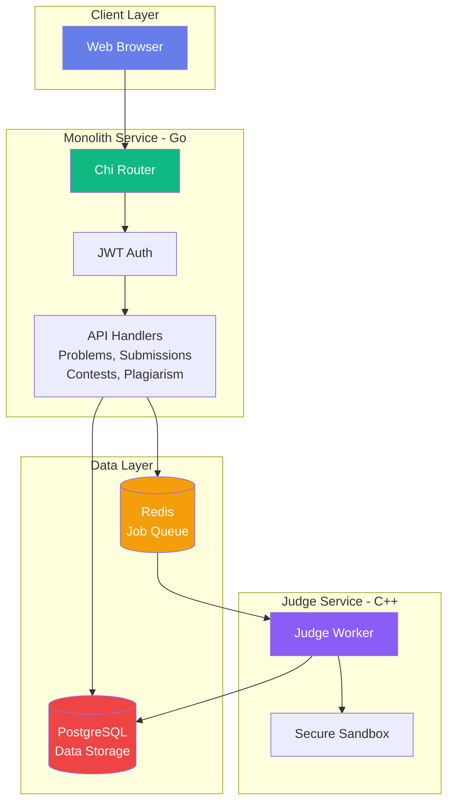

# CodeJudge - Online Judge Platform

<div align="center">


A production-ready online judge system featuring real-time contest management, automated plagiarism detection, and secure sandboxed code execution.

[Features](#features) • [Quick Start](#quick-start) • [Architecture](#architecture) • [Documentation](#documentation) • [API](#api-reference)

</div>

---

## Features

### Core Functionality
- **Problem Management** - Comprehensive problem creation and administration
- **Multi-Language Support** - C++, Python, Java compilation and execution
- **Secure Execution** - Isolated sandboxed environment with strict resource limits
- **Automated Judging** - Fast verdict delivery with detailed test case feedback
- **Test Case Management** - Support for public examples and hidden evaluation cases

### Contest System
- **Time-based Contests** - Full lifecycle management (Upcoming, Active, Finished)
- **Live Leaderboard** - Real-time ranking system with automatic updates
- **Leaderboard Freeze** - Configurable freeze period for final standings
- **Custom Scoring** - Flexible point allocation per problem
- **Registration System** - User enrollment and eligibility management
- **Penalty Calculation** - Time-based penalty system for rankings

### Plagiarism Detection
- **Automated Analysis** - MinHash LSH algorithm for code similarity detection
- **Submission Comparison** - Pairwise analysis across all submissions
- **Administrative Reports** - Detailed flagged submission review interface

### User Interface
- **Responsive Design** - Cross-platform compatibility
- **Dark Mode** - Optimized viewing experience
- **LaTeX Support** - Mathematical equation rendering via KaTeX
- **Real-time Updates** - Live submission status tracking
- **Accessibility** - Mobile-responsive layout

### Security & Administration
- **JWT Authentication** - Token-based secure session management
- **Role-based Access Control** - Granular permission system
- **Administrative Dashboard** - Centralized platform management
- **Rate Limiting** - Request throttling and abuse prevention

---

## Quick Start

### Prerequisites
- Docker 20.10+ and Docker Compose 2.0+
- Minimum 4GB RAM
- 10GB available disk space

### Installation

```bash
# Clone the repository
git clone https://github.com/kwant-dbg/CodeJudge.git
cd CodeJudge

# Start all services
docker-compose up -d --build

# Access the platform
# Navigate to http://localhost:8080 in your browser
```

The application will be available at `http://localhost:8080` once all containers are running.

### Initial Setup

1. Register an account through the registration interface
2. Browse the problem set and review available challenges
3. Submit solutions for automated evaluation
4. Participate in scheduled contests
5. (Administrator) Access administrative functions for contest and problem management

---

## Architecture

CodeJudge uses a **monolithic architecture** for simplicity and performance:



**📚 Detailed Architecture:** See [ARCHITECTURE.md](docs/ARCHITECTURE.md) for comprehensive diagrams including:
- System architecture overview
- Request flow diagrams
- Database schema (ERD)
- Authentication flow
- Contest system logic
- Security layers
- Deployment architecture


---

## Project Structure

```
codejudge/
├── monolith/              # Go Backend Service
│   ├── handlers/
│   │   ├── auth.go           # Authentication & user management
│   │   ├── problems.go       # Problem CRUD operations
│   │   ├── submissions.go    # Code submission & judging
│   │   ├── contests.go       # Contest management & leaderboards
│   │   ├── plagiarism.go     # Similarity detection
│   │   └── admin.go          # Admin operations
│   ├── static/
│   │   ├── index.html        # Homepage & navigation
│   │   ├── problem.html      # Problem view & submit
│   │   ├── contests.html     # Contest listings
│   │   ├── contest-detail.html   # Contest leaderboard
│   │   ├── create-contest.html   # Admin: Create contest
│   │   └── ...
│   ├── main.go               # Server entrypoint
│   └── Dockerfile.standalone
│
├── judge/                  # C++ Judge Service
│   ├── modern_main.cpp       # Judge worker
│   ├── sandbox.cpp           # Secure execution sandbox
│   ├── sandbox.h
│   └── Dockerfile.modern
│
├── common/                 # Shared Go Libraries
│   ├── auth/                 # JWT utilities
│   ├── dbutil/               # Database connection pooling
│   ├── health/               # Health checks
│   ├── httpx/                # HTTP helpers
│   └── redisutil/            # Redis queue management
│
├── docs/
│   ├── ARCHITECTURE.md       # Detailed architecture diagrams
│   ├── CONTESTS_FEATURE.md   # Contest system documentation
│   ├── DEPLOYMENT.md         # Deployment guides
│   └── SAMPLE_*.md           # Sample data
│
├── deploy/                 # Deployment Scripts
│   ├── azure-deploy.ps1
│   ├── seed-db.sh
│   └── seed-db.sql
│
└── docker-compose.yml        # Local Development Setup
```

---

## How It Works


**Submission Processing Flow:**
1. Client submits source code via REST API
2. Monolith service persists submission to PostgreSQL with PENDING status
3. Job enqueued to Redis for asynchronous processing
4. Judge worker dequeues job and executes in isolated sandbox
5. Test cases evaluated with enforced time and memory constraints
6. Verdict stored in database with detailed execution metrics
7. Client retrieves results via polling or webhook

---

## Development

### Local Development Environment

```bash
# Install Go dependencies
cd monolith
go mod download

# Run monolith service (requires PostgreSQL and Redis running)
go run main.go

# Compile judge service
cd ../judge
g++ -std=c++17 modern_main.cpp sandbox.cpp -o judge
```

### Database Setup

```bash
# Initialize database with sample data
cd deploy
./seed-db.sh

# Manual initialization
psql -U postgres -d codejudge -f seed-db.sql
```

### Docker Development Workflow

```bash
# Rebuild specific service
docker-compose build monolith
docker-compose up -d monolith

# Monitor service logs
docker-compose logs -f monolith judge

# Clean rebuild
docker-compose down -v
docker-compose up -d --build
```

---

## Testing

```bash
# Execute full test suite
cd monolith
go test ./...

# Run specific package tests
go test ./handlers -v

# Generate coverage report
go test -coverprofile=coverage.out ./...
go tool cover -html=coverage.out
```

---

## Documentation

- **[Architecture Guide](docs/ARCHITECTURE.md)** - System design, database schema, flows
- **[Contest System](docs/CONTESTS_FEATURE.md)** - Contest API, leaderboard logic
- **[Deployment Guide](docs/DEPLOYMENT.md)** - Azure, Docker, production setup
- **[Sample Problems](docs/SAMPLE_PROBLEMS.md)** - Example problem set
- **[Sample Solutions](docs/SAMPLE_SOLUTIONS.md)** - Reference solutions

---

## API Reference

### Authentication
- `POST /api/register` - Create new user
- `POST /api/login` - Get JWT token
- `POST /api/validate` - Validate JWT
- `GET /api/me` - Get current user info

### Problems
- `GET /api/problems` - List all problems
- `GET /api/problems/:id` - Get problem details
- `POST /api/problems` - Create problem (admin)
- `POST /api/problems/:id/testcases` - Add test cases (admin)

### Submissions
- `POST /api/submissions` - Submit solution
- `GET /api/submissions/:id` - Get submission status

### Contests
- `GET /api/contests` - List contests
- `POST /api/contests` - Create contest (admin)
- `GET /api/contests/:id` - Get contest details
- `POST /api/contests/:id/register` - Register for contest
- `GET /api/contests/:id/leaderboard` - Live leaderboard
- `POST /api/contests/:id/problems` - Add problem to contest (admin)

### Plagiarism
- `GET /api/plagiarism/reports` - Get plagiarism reports (admin)

**Example Submission:**
```json
{
  "problem_id": 1,
  "language": "cpp",
  "source_code": "#include <iostream>\nint main() { int a, b; std::cin >> a >> b; std::cout << a + b; return 0; }"
}
```

**Full API documentation:** See [ARCHITECTURE.md](docs/ARCHITECTURE.md#api-endpoints)

---

## Roadmap

Planned features and enhancements:

- [ ] Additional language support (Rust, JavaScript, Go)
- [ ] Virtual contest mode for practice
- [ ] Editorial and solution explanation system
- [ ] User profile pages with detailed statistics
- [ ] Community discussion forums
- [ ] Email notification system
- [ ] PDF export functionality for submissions
- [ ] Native mobile applications

---

## Contributing

Contributions are welcome. Please adhere to the following workflow:

1. Fork the repository
2. Create a feature branch (`git checkout -b feature/feature-name`)
3. Commit changes with descriptive messages (`git commit -m 'Add feature description'`)
4. Push to the branch (`git push origin feature/feature-name`)
5. Submit a Pull Request with detailed description

### Code Style Guidelines
- **Go**: Follow [Effective Go](https://golang.org/doc/effective_go) conventions
- **C++**: Apply `clang-format` with Google style guide
- **Frontend**: Maintain 2-space indentation with semicolons

---

## License

This project is licensed under the MIT License. See the [LICENSE](LICENSE) file for complete terms and conditions.

---

## Author

**Harshit Sharma**
- GitHub: [@kwant-dbg](https://github.com/kwant-dbg)

---

## Acknowledgments

- Architecture inspired by competitive programming platforms including Codeforces and AtCoder
- Plagiarism detection implements MinHash LSH algorithm
- Secure execution utilizes Linux namespaces and cgroups
- Mathematical rendering powered by KaTeX library

---

<div align="center">

**CodeJudge** - Production-ready online judge platform

</div>


