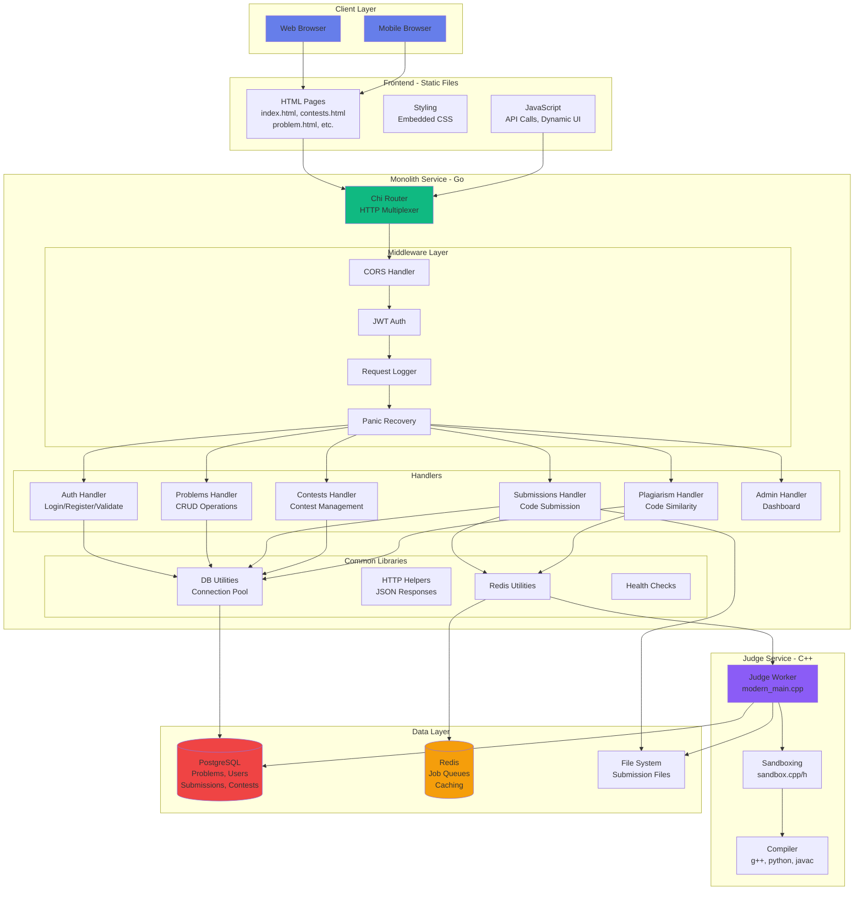
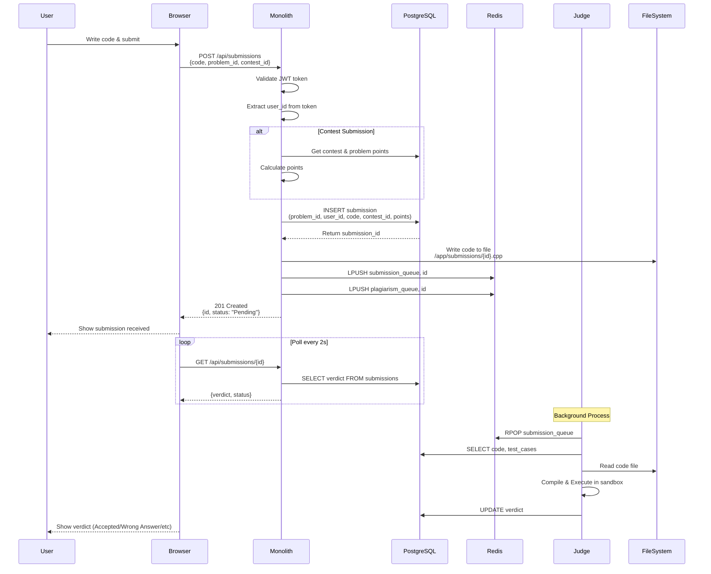
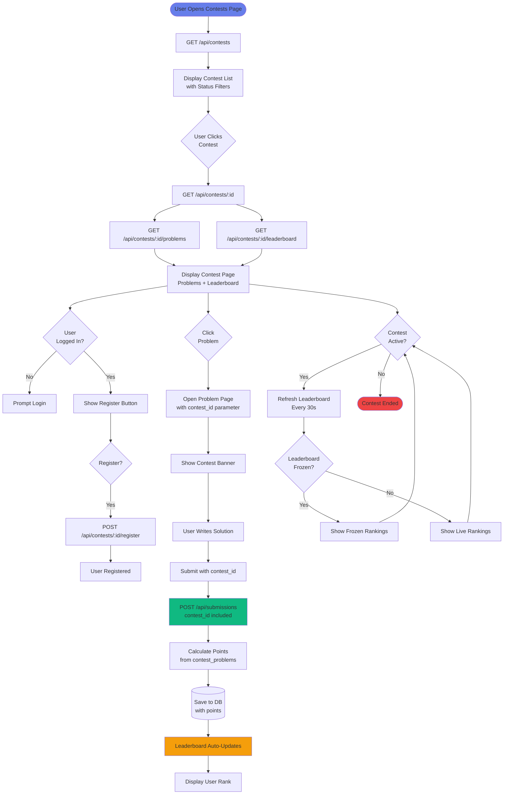
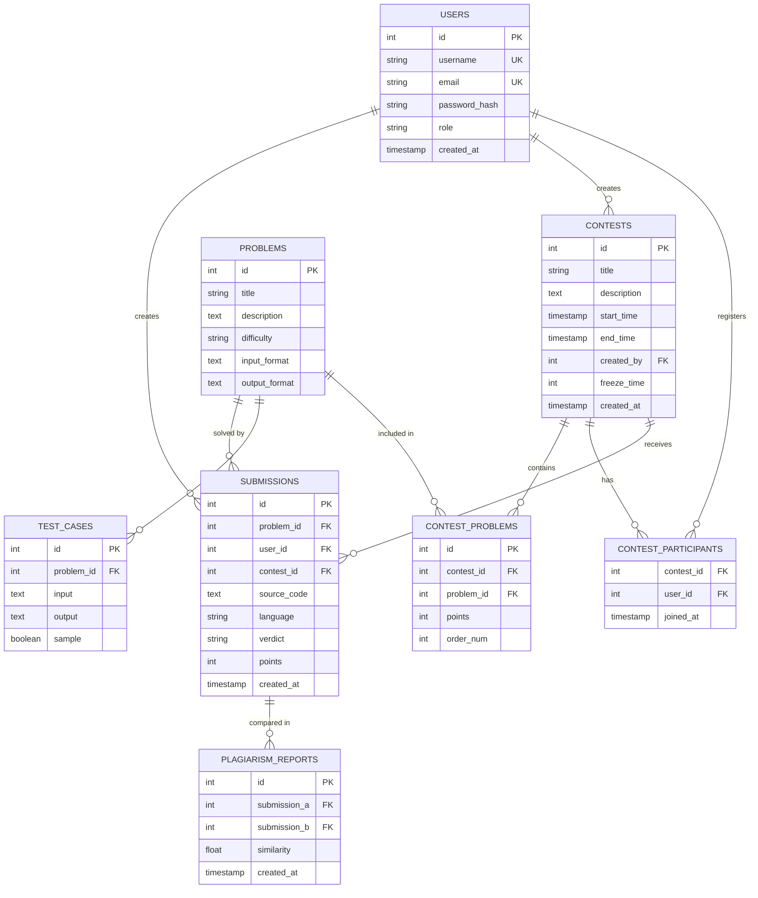
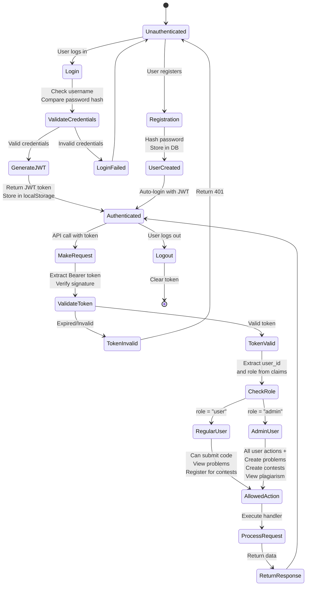
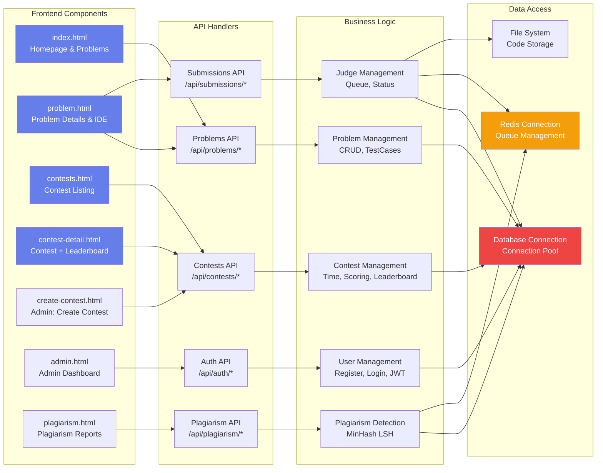
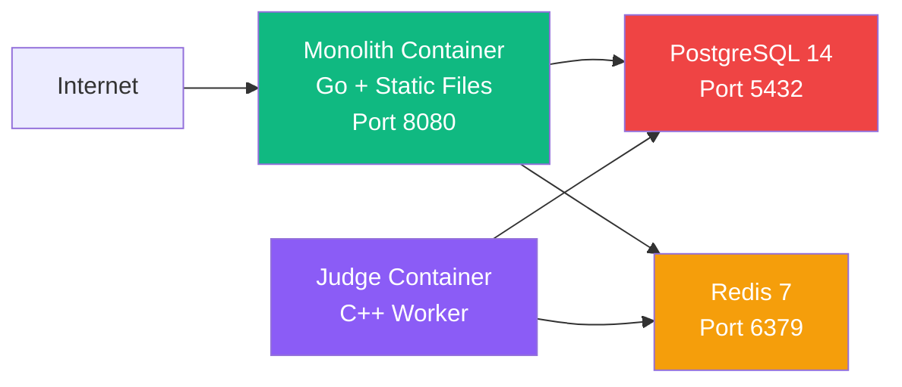
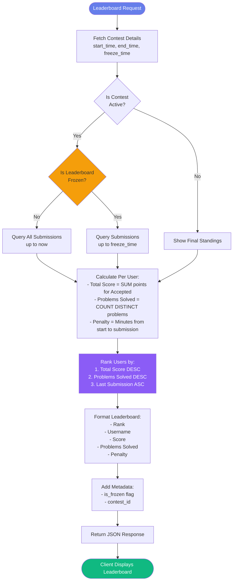

# CodeJudge Architecture Documentation

This document provides comprehensive architecture diagrams for the CodeJudge monolithic system.

## System Architecture Overview

---

## Request Flow - User Submission

---

## Contest System Flow

---

## Database Schema

---

## Authentication & Authorization Flow

---

## Component Architecture

## Deployment Architecture

---

## Leaderboard Calculation Logic

